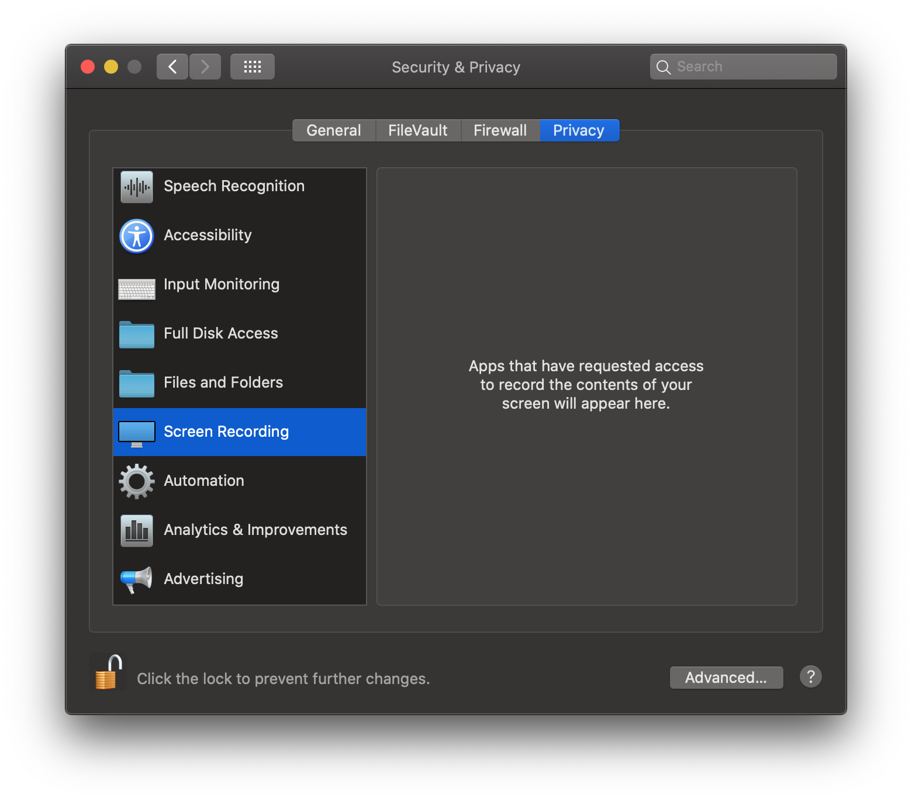
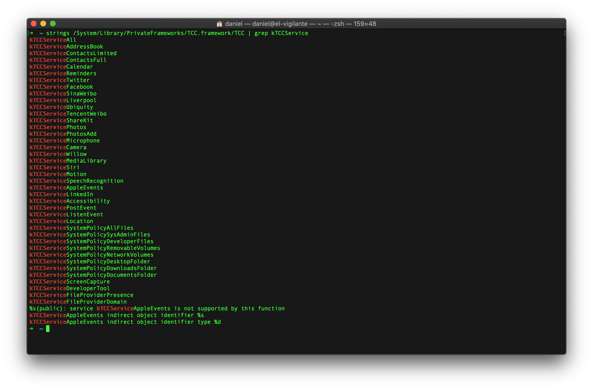
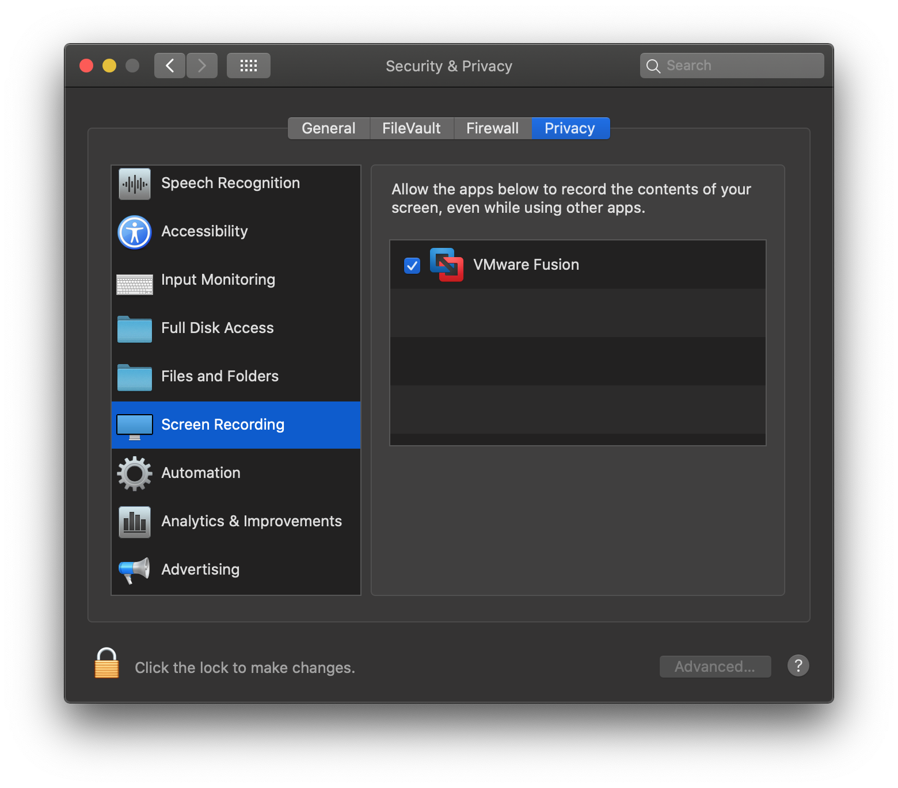
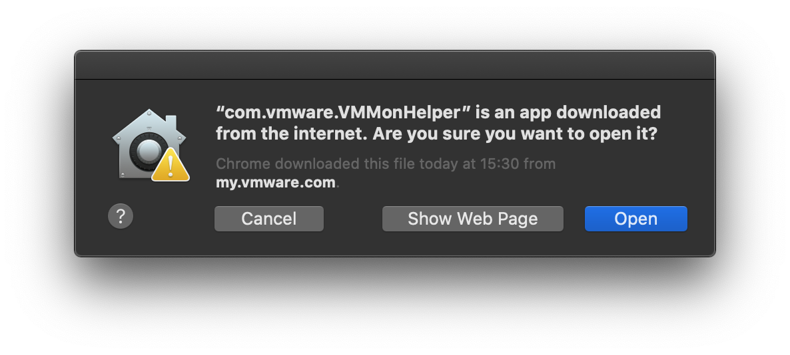
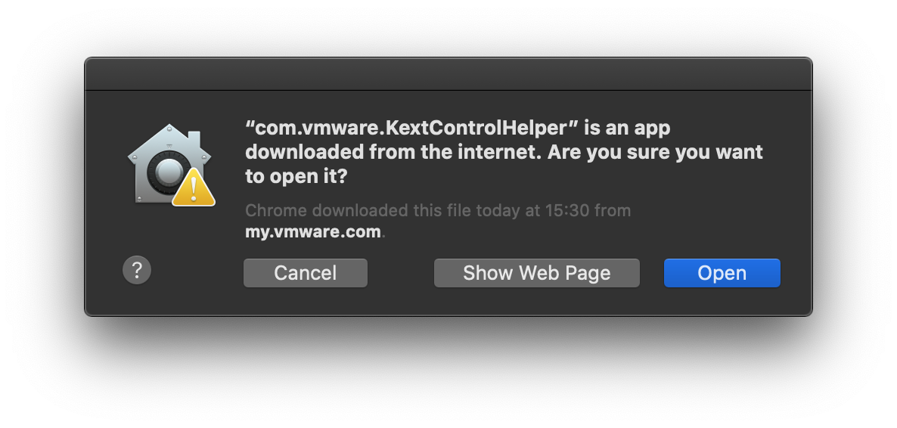
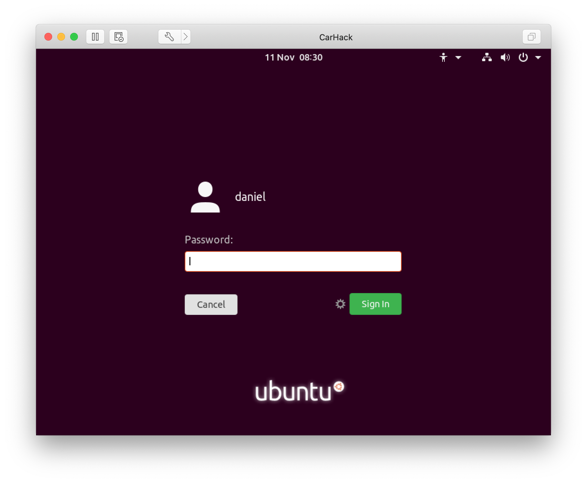

# OS X Catalina Hacks & Tweaks

So you upgraded to Catalina and noticed a whole host of things don't work? Yeah annoying but here's some fixes that may help.

## VMWare Fusion 10.x Black Screen

Booting up any VM's in 10.1.6 will result in a blank screen. This is due to the new privacy and setting screens not allowing screen recordings. Sadly it seems the only easy way to solve this is to upgrade to Fusion 11.x, well bugger this for a game of soldiers, here's the fix.

1. Boot your mac into recovery mode. Restart and when you see the apple logo, hold down CMD + R.
2. Once it is up, log in using your credentials and go to utilities at the top and terminal.
3. We need to disable System Integrity Protection, which protects your mac from malicious things by enforcing them at the kernel. All well and good normally but not when you want to use legitimate software, so type in `csrutil disable` and reboot
4. Once you are back, open up terminal.app. OS X has a number of accessibility commands and you can access these from the command line using a cool tool called /usr/bin/tccutil. The command you want to enter is:

`tccutil reset All com.vmware.fusion`

Sadly you cannot add items to this screen manually, this is what it looks like before we ran the command

5. Next step is to add one entry into the TCC SQLite3 database for TCC, namely kTCCServiceScreenCapture.Catalina specifically needs apps to request this, but Fusion doesn't and therein lies the problem. If you are nosy, you can see all the services that TCC supports using this command

`strings /System/Library/PrivateFrameworks/TCC.framework/TCC | grep kTCCService`

`sudo sqlite3 "/Library/Application Support/com.apple.TCC/TCC.db" 'insert into access values ("kTCCServiceScreenCapture", "com.vmware.fusion", 0, 1, 1, "", "", "", "UNUSED", "", 0,1565595574)'`

Time to reboot and get back into recovery mode. Then once in, follow steps 2 and 3 except run

`csrutil enable`

and reboot.

You should now see this when you go to the accessibility screen

Launching VMWare Fusion should now look something like this

